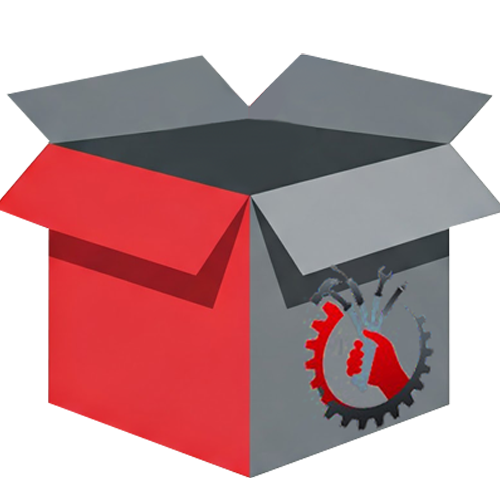

   
  
    

  <h1>📦 TecnoDeposit</h1>
  <h3>✨ Il Tuo Magazzino Digitale Intelligente, Sicuro e Veloce ✨</h3>

  

    
  

  

    <strong><a href="#-funzionalità-core" style="text-decoration: none;">Funzionalità</a></strong> •
    <strong><a href="#%EF%B8%8F-architettura-e-stack" style="text-decoration: none;">Architettura</a></strong> •
    <strong><a href="#-ruoli-e-permessi" style="text-decoration: none;">Ruoli</a></strong> 
  

  
  

    
    
    
    
    
  

 

---

## 📖 Cos'è TecnoDeposit?

**TecnoDeposit** è una Web Application Java EE di livello enterprise nata per snellire, digitalizzare e tracciare l'intero ecosistema di un magazzino moderno. Abbandona i fogli di calcolo disordinati: TecnoDeposit gestisce **articoli**, **fornitori**, **flussi di garanzia** e, soprattutto, introduce un **sistema di richieste materiali** dinamico tra i tecnici e l'amministrazione, con cambi di stato fluenti (In Attesa ➔ Approvata ➔ Spedita ➔ Consegnata).

Pensato per la logistica rapida, il software integra **lettura e stampa di QR Code**, un sistema di **Accesso Totem** tramite token a vita brevissima e un design full-responsive motorizzato Tailwind CSS.

---

## ⚡ Architettura e Stack Tecnologico

Il progetto segue il classico e solido pattern architetturale **MVC (Model-View-Controller)** applicato all'ecosistema Jakarta EE, spinto ad alte prestazioni:

### ⚙️ Backend (Java 17 / Jakarta Servlets)
- **Controller Layer**: Un set di `HttpServlet` esposti via URI map (`@WebServlet`). Gestiscono esclusivamente smistamento dati, validazioni e risposte JSON (per API AJAX) o inoltro (`RequestDispatcher`) alle JSP.
- **DAO Layer (Data Access Object)**: Classi dedicate (`TokenDAO`, `UserDAO`, ecc.) che implementano `PreparedStatement` crudi e transazioni `JDBC` verso MySQL.
- **Security**: 
  - Hash delle password tramite `JBCrypt`.
  - Crittografia a riposo `AES-256` per dati critici (Payload chiavi o OTP interni).
  - Filtri Servlet (`AuthFilter`) per blindare le interfacce sensibili contro accessi non autenticati.
- **Background Tasks**: Listener Java (es. `TokenCleanupListener`) per la logistica automatica del databse (pulizia token scaduti).

### 🎨 Frontend (JSP / JS Vanilla / Tailwind)
- **Views (JSP)**: Pagine modulari sviluppate con frammenti riutilizzabili (`.jspf` inclusi dinamicamente come Header e Footer).
- **Styling**: `Tailwind CSS`, caricato via CDN/asset, per prototipazione fulminea e UI pixel-perfect.
- **Interattività Vanilla**: Niente framework pesanti come React o Angular. Tutto il DOM è manipolato on-demand da JS ES6, per la massima leggerezza.
- **Librerie Client-side**:
  - `qrcodejs`: Generazione ultra-low-latency di ticket e accessi QR.
  - `jsPDF` / `XLSX.js`: Esportazioni massive di etichette PDF ad alta qualità o database Excel interamente nel browser client (Zero overhead sul server).
---
## 🧗‍♂️ Sfide Tecniche e Soluzioni

Durante lo sviluppo di TecnoDeposit, ho dovuto affrontare e risolvere diverse complessità legate all'interazione tra software e hardware di magazzino:

* **Gestione Asincrona della Sicurezza (Token a vita breve):** Per garantire la sicurezza del Totem senza costringere i tecnici a digitare password continue, ho implementato un sistema di login tramite QR-SSO. La sfida era evitare l'accumulo di token scaduti nel database. Ho risolto creando un `TokenCleanupListener` in Java che gira in background e si occupa della logistica automatica e della pulizia periodica, mantenendo il database MySQL sempre leggero e performante.
* **Digital Scan Hotfix (Incompatibilità Hardware):** I lettori ottici e gli scanner industriali spesso simulano l'input da tastiera. Ho riscontrato che molti scanner economici arrivano pre-configurati con layout di tastiera US, il che generava un parsing errato dei caratteri speciali del QR Code sui sistemi operativi italiani. Ho scritto un middleware in Vanilla JS che intercetta i codici ASCII in ingresso, applica una mappatura correttiva (Hotfix) e ricostruisce la stringa originale prima di inviarla al backend.
* **Zero-Overhead per le Esportazioni (Client-Side Rendering):** Per evitare di sovraccaricare il server Tomcat durante la generazione massiva di etichette e report Excel, ho spostato interamente il carico di lavoro sul client. Utilizzando `jsPDF` e `XLSX.js`, i dati grezzi ricevuti in JSON vengono renderizzati e scaricati direttamente dal browser dell'utente, mantenendo il server libero di gestire solo le transazioni CRUD.

---

## 🚀 Funzionalità Core

*   **🏭 Gestione Articoli & Fornitori**: Tracciamento di numeri di matricola, invii DDT, resi in garanzia e rientri con associazione grafica.
*   **🛒 Richieste Materiale Interattive**: I tecnici compilano carrelli della spesa, l'amministratore valuta, rifiuta, o approva e scatena il flusso logistico. 
*   **🖨️ Stampa Etichette Termiche**: Auto-generazione di layout PDF 64x25mm per stampanti termiche contenenti QR matricolari.
*   **📱 Area Totem Articoli**: Postazione fisica per la scansione rapida tramite barcode/QR. Include sblocco postazione via PIN, accesso tecnico tramite QR-SSO e azioni di magazzino (Assegna/Deposita) pilotabili da tastierino numerico. 
*   **🔐 Svuotamento Magazzino Protetto**: Distruzione atomica via "Drop" protetta non solo da password ma da OTP e consensi espliciti.

---

## 📱 Totem Articoli: Postazione Operativa

Il sistema **Totem** è una modalità d'uso "chiosk" progettata per tablet o terminali industriali posizionati fisicamente in magazzino. Permette operazioni ultra-rapide riducendo al minimo l'interazione manuale.

### 🔐 Flusso di Sicurezza (3 Livelli)
1.  **Sblocco Postazione**: L'amministratore inserisce il **PIN** per attivare il chiosk.
2.  **Login Operatore**: Il tecnico scansiona il proprio **QR Token** (generato dalla WebApp) per identificarsi senza password.
3.  **Scansione Articoli**: Una volta loggati, ogni codice a barre o QR scansionato aggiunge l'articolo alla coda operativa.

### ⌨️ Scorciatoie Tastierino Numerico
L'interfaccia è ottimizzata per essere pilotata interamente da un tastierino fisico o scanner:
*   **Tasto Assegna**: Apre il pannello di **Assegnazione** (Assegna il materiale scansionato al tecnico loggato).
*   **Tasto Deposito**: Apre il pannello di **Deposito** (Restituisce il materiale al magazzino).
*   **`Invio (Enter)`**: Conferma l'azione corrente. Per l'assegnazione, un timer di 5 secondi permette l'annullamento rapido prima del salvataggio.
*   **Annulla**: Annulla l'operazione, svuota la coda e scollega l'operatore per motivi di privacy.

### 🛠️ Ottimizzazione Hardware
*   **Digital Scan Hotfix**: Gestione automatica dei caratteri speciali per scanner configurati con layout tastiera statunitense (US) su sistemi italiani.
*   **Visual Feedback**: Animazioni grafiche (Dolly) e segnali acustici/visivi per confermare l'avvenuto caricamento a sistema.

---

## 🎭 Ruoli e Permessi

L'app scala in base all'utenza loggata:

| Ruolo | Poteri e Visuali |
| :--- | :--- |
| 👑 **Amministratore** | Accesso divino. Può gestire utenti, accettare carrelli richieste da tech, avviare reset magazzino, refresh blob immagini ed esportazioni Excel totali. |
| 📦 **Magazziniere** | Cuore pulsante dell'inventario. Aggiunge/modifica scorte liberamente, smarca e spedisce materiale. Non può gestire utenti o distruggere il database. |
| 🔧 **Tecnico** | Utente "cliente" del magazzino. Sfoglia il catalogo, effettua ordini e opera sulla postazione fisica **Totem** per caricare/scaricare materiale in tempo reale. |

---

## 👨‍💻 Autore e License

  
   
  <strong>Francesco Coppola</strong>
   
  
Progetto Proprietario - Tutti i Diritti Riservati   📧 assistenza@tecnodeposit.it

